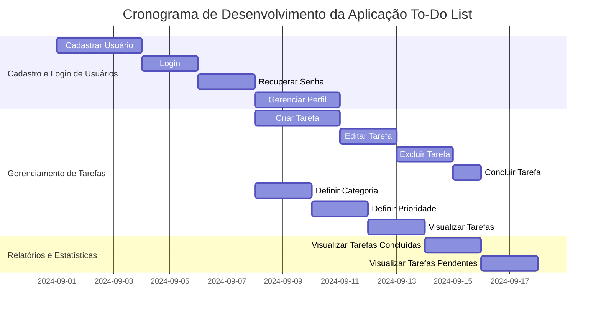
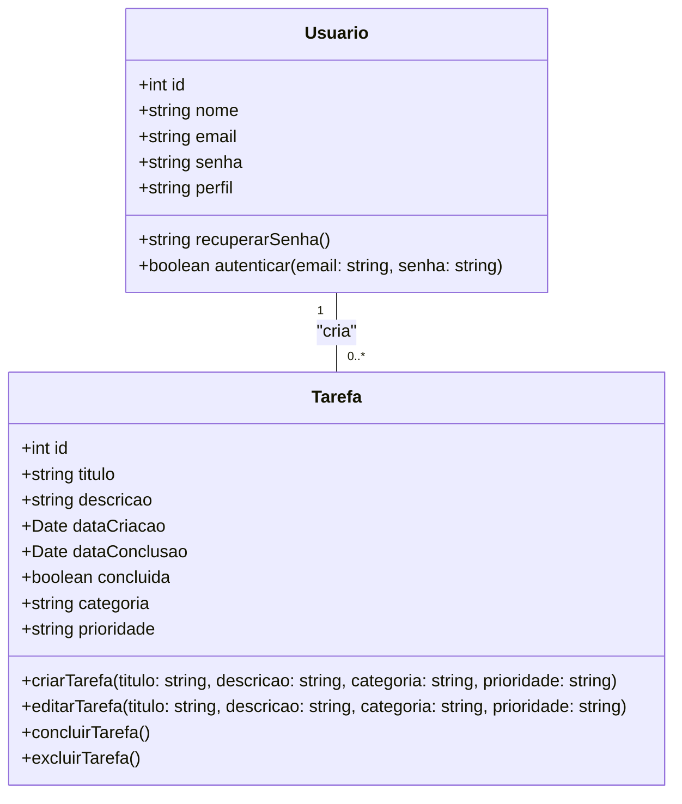
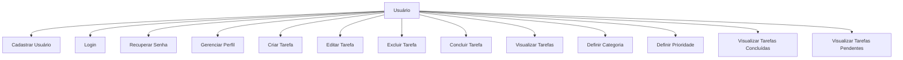
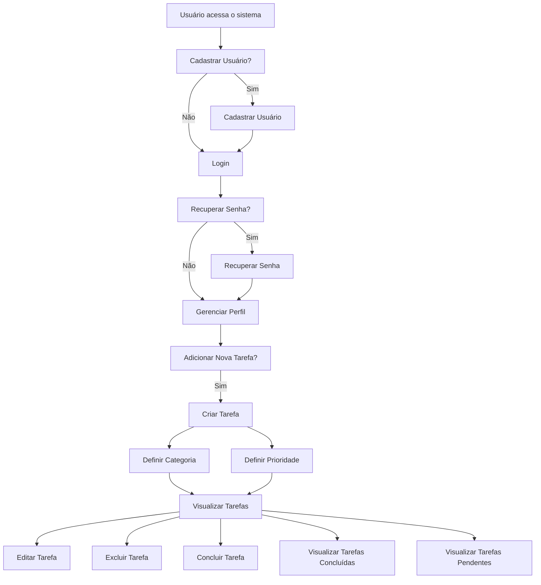

# Projeto: Aplicação To-Do List

## Escopo do Projeto

**Funcionalidades Principais:**
1. **Cadastro e Login de Usuários:**
   - Autenticação segura com opções de recuperação de senha.
   - Perfis de usuário personalizados.

2. **Gerenciamento de Tarefas:**
   - Criação, edição e exclusão de tarefas.
   - Marcação de tarefas como concluídas.
   - Atribuição de categorias e prioridades.

4. **Interface Intuitiva:**
   - Design responsivo e amigável.

5. **Segurança:**
   - Proteção de dados com criptografia.
   - Controle de acesso baseado em permissões.

6. **Relatórios e Estatísticas:**
   - Visualização de tarefas concluídas e pendentes.

## Objetivos SMART

- **Específico:** Desenvolver uma aplicação de To-Do List que permita aos colaboradores da Escola SENAI criar, editar, excluir e categorizar tarefas, bem como configurar lembretes e receber notificações. A aplicação deve ser intuitiva, segura e acessível.

- **Mensurável:** A aplicação deve ser completada com todas as funcionalidades principais implementadas e testadas, incluindo criação, edição e exclusão de tarefas, configuração de lembretes e notificações. O sucesso será medido pela implementação completa e pela realização de testes funcionais e de segurança, com um objetivo de 100% de cobertura dos requisitos estabelecidos.

- **Atingível:** Utilizar tecnologias adequadas, como JavaScript (React), Node.js e banco de dados MongoDB, e uma equipe qualificada composta por desenvolvedores front-end e back-end, designers de UI/UX e especialistas em segurança. Garantir que todos os recursos e conhecimentos necessários estejam disponíveis e acessíveis para o desenvolvimento do projeto.

- **Relevante:** A aplicação deve melhorar significativamente a organização e a gestão das tarefas dos colaboradores da Escola SENAI, resultando em maior eficiência e produtividade. A solução atenderá às necessidades de gerenciamento de tarefas e ajudará a otimizar os processos internos da escola.

- **Tempo:** Concluir o desenvolvimento e os testes da aplicação em até 3 meses a partir do início do projeto. Após a conclusão, realizar o treinamento dos usuários e a implementação da aplicação em até 1 mês. A coleta de feedback e a implementação de melhorias contínuas devem ser concluídas em até 2 meses após a implementação inicial.

## Cronograma

1. **Planejamento e Pesquisa (2 semanas)**
   - Reunião inicial com stakeholders.
   - Definição de requisitos e análise de mercado.

2. **Design da Aplicação (3 semanas)**
   - Criação de wireframes e protótipos.
   - Revisão e aprovação do design.

3. **Desenvolvimento (8 semanas)**
   - Configuração do ambiente de desenvolvimento.
   - Implementação das funcionalidades principais.
   - Integração de segurança e banco de dados.
   - Desenvolvimento de APIs (se necessário).

4. **Testes e Ajustes (4 semanas)**
   - Testes funcionais e de segurança.
   - Correção de bugs e ajustes com base no feedback.

5. **Treinamento e Implementação (4 semanas)**
   - Desenvolvimento de material de treinamento.
   - Realização de sessões de treinamento.
   - Lançamento da aplicação para todos os colaboradores.

6. **Avaliação e Melhoria Contínua (2 meses)**
   - Coleta de feedback.
   - Implementação de melhorias baseadas no feedback.

## Diagrama de Gantt:

## Análise de Risco

1. **Risco: Atrasos no Desenvolvimento**
   - **Probabilidade:** Moderada
   - **Impacto:** Alto
   - **Mitigação:** Estabelecer prazos claros e realizar reuniões semanais de acompanhamento.

2. **Risco: Problemas de Segurança**
   - **Probabilidade:** Baixa
   - **Impacto:** Alto
   - **Mitigação:** Realizar auditorias de segurança e testes de penetração.

3. **Risco: Resistência dos Usuários à Nova Ferramenta**
   - **Probabilidade:** Moderada
   - **Impacto:** Médio
   - **Mitigação:** Oferecer treinamento adequado e suporte contínuo.

4. **Risco: Bugs e Falhas na Aplicação**
   - **Probabilidade:** Alta
   - **Impacto:** Alto
   - **Mitigação:** Testar exaustivamente antes do lançamento e ter uma equipe de suporte disponível para correções rápidas.

5. **Risco: Falta de Adoção de Funcionalidades**
   - **Probabilidade:** Moderada
   - **Impacto:** Médio
   - **Mitigação:** Realizar pesquisas com usuários durante o desenvolvimento para garantir que as funcionalidades atendam às suas necessidades.

## Recursos

1. **Equipe de Desenvolvimento:**
   - Desenvolvedores front-end e back-end.
   - Designer de UI/UX.
   - Especialista em segurança.

2. **Tecnologias e Ferramentas:**
   - Linguagens de programação: JavaScript (React), Node.js.
   - Banco de Dados: MongoDB.

3. **Infraestrutura:**
   - Servidores para hospedar a aplicação.
   - Serviços de backup e recuperação.

4. **Custos:**
   - Custo de desenvolvimento (salários e honorários).
   - Licenças de software e ferramentas.
   - Treinamento e suporte.

---

# Diagramas:
## Classe:

## Uso:

## Fluxo

---
# Prototipagem:
## Manual de Identidade Visual:

### Introdução

Este guia fornece as diretrizes para a aplicação correta da identidade visual do SENAI-SP em ambientes digitais, como software e plataformas online.

### Marca Preferencial

- **Uso Preferencial**: Em fundo branco.
- **Altura Mínima**: 14 px em digital.
- **Área de Não Interferência**: Espaço equivalente à distância da letra “i” até o término do logo.

### Cores

#### Cores Primárias

- **Vermelho**: 
  - Pantone 485
  - Hex: #e30613
- **Branco**: 
  - Hex: #ffffff
- **Preto**: 
  - Hex: #000000
- **Cinza Claro**: 
  - Hex: #878787

#### Cores Variantes

- **Pantone 7622**: Hex #9a1915
- **Pantone 1815**: Hex #681413

#### Monocromias

- **Preto**: Hex #000000
- **Cinza**: Hex #878787
- **Branco**: Hex #ffffff

### Aplicações Digitais

#### Sobre Fundos Coloridos

- **Preferência**: Aplicar a marca em vermelho sempre que possível.
- **Contraste**: Garantir alto contraste com o fundo para legibilidade.

#### Uso de Logotipo

- **Não Alterar**: Cor do texto, proporções ou adicionar efeitos.
- **Não Usar**: Como marca d’água ou sobre fundos sem contraste adequado.

### Fontes

- **Montserrat**:
  - **Títulos e Cabeçalhos**: Bold, Semibold.
  - **Texto**: Regular, Light.

### Recomendações para Desenvolvimento de Software

1. **Aplicação do Logotipo**: Utilize o logotipo preferencialmente em fundo branco ou com alto contraste.
2. **Paleta de Cores**: Adote as cores primárias e variantes para criar uma interface harmoniosa e alinhada com a identidade visual.
3. **Tipografia**: Use a fonte Montserrat para títulos e textos, seguindo as variações indicadas.
4. **Consistência**: Mantenha a integridade da marca seguindo as diretrizes de altura mínima e área de não interferência.

## Baixa fidelidade:

